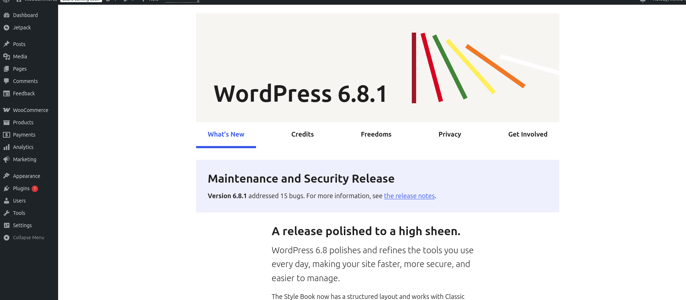

# Training Notes

## 1. Các sản phẩm cơ bản của Vietnix

### a. Hosting
Cung cấp tài nguyên máy chủ để lưu trữ website.

- **Shared Hosting**: Dùng chung máy chủ.
- **Dedicated Hosting**: Thuê một máy vật lý, toàn quyền kiểm soát.

### b. VPS Hosting
Kết hợp giữa Shared và Dedicated, dùng chung một máy vật lý nhưng được chia nhỏ ra.

- **VPS**: Cung cấp một máy ảo hoạt động như một máy vật lý.

### c. Domain
Hệ thống chuyển đổi tên miền thành địa chỉ IP của máy chủ.

### d. DNS - Domain Name System
Các loại bản ghi DNS:

- **CNAME Record**: Bản ghi tên quy chuẩn (Canonical Name Record), đặt bí danh cho tên miền này bằng một tên miền khác. Ví dụ: A Record cho `vietnix.vn` trỏ đến IP server, sau đó CNAME Record `www.vietnix.vn` trỏ đến `vietnix.vn`.
- **A Record**: Trỏ tên miền website tới một địa chỉ IP cụ thể.
- **MX Record**: Trỏ tên miền đến mail server.
- **AAAA Record**: Trỏ tên miền đến địa chỉ IPv6, kèm TTL và IPv6.
- **TTL**: Time to Live, thời gian một đối tượng được lưu trữ trong bộ nhớ đệm trước khi bị xóa hoặc làm mới. Trong CDN, TTL liên quan đến bộ nhớ đệm nội dung, lưu trữ bản sao tài nguyên trang web trên proxy CDN để cải thiện tốc độ tải trang và giảm tiêu thụ băng thông của server gốc.
- **TXT Record**: Chứa các thông tin định dạng văn bản cho domain, có thể thêm giá trị TXT, Host mới, TTL và Point To.
- **SRV Record**: Xác định dịch vụ chạy trên port nào, thêm Priority, Port, Weight, TTL, Point to Point.
- **NS Record**: Chỉ định Name Server cho từng tên miền phụ, tạo Name Server, TTL hoặc host mới.

**Loại NS**:
- **Root Name Server**: Dịch vụ phân giải tên miền gốc, khoảng 12 DNS root server trên thế giới, quản lý tất cả tên miền cấp cao (Top-level). Khi có yêu cầu phân giải tên miền thành địa chỉ IP, client gửi yêu cầu đến DNS gần nhất (DNS ISP), sau đó kết nối tới DNS root server để hỏi địa chỉ của Domain Name.
- **Local Name Server**: Chứa thông tin để truy xuất và tìm kiếm máy chủ tên miền.
- **DNS Recursor**: Chuyển đổi tên miền thành địa chỉ IP. Nếu không tìm thấy thông tin trong cơ sở dữ liệu, nó liên hệ với các DNS Recursor khác và sử dụng bộ nhớ đệm để lưu trữ thông tin đã truy cập.
- **TLD Name Server (Top Level Domain)**: Lưu trữ thông tin về các tên miền có phần mở rộng chung (gTLD) như `.com`, `.org`, `.net`.
- **Authoritative Name Server**: Lưu trữ thông tin về tên miền và địa chỉ IP tương ứng, là điểm cuối của quá trình truy vấn và phân giải địa chỉ IP.

**Colocation**: Doanh nghiệp mua thiết bị (router, server,...) nhưng đặt trong cơ sở của nhà cung cấp dịch vụ.

## 2.1. cPanel
cPanel là bảng điều khiển lưu trữ web dựa trên Linux, cung cấp giao diện đồ họa thân thiện để quản lý website và tài nguyên máy chủ.

**Tính năng**:

### Email
- Tạo, xóa, kiểm tra, quản lý email, cấu hình email cho mail client.
- **Forwarders**: Chuyển tiếp email đến một email khác. Ví dụ: forward các email gửi đến `test1@hosting.com` → `tech@vietnix.vn`.
- **Email Routing**: Định tuyến email nhận đến một server cụ thể (phải luôn đặt local mail exchanger).
- **Autoresponders**: Cấu hình trả lời email tự động.
- **Default Address**: Cấu hình Catch-all Email. Thay vì trả về thông báo “No Such User Here” khi email gửi đến địa chỉ không tồn tại, hosting sẽ chuyển email đó đến email mặc định.
- **Mailing Lists**: Gửi email đến `tech@vietnix.vn` sẽ được gửi đồng thời đến tất cả email trong group.
- **Track Delivery**: Theo dõi trạng thái email gửi ra.
- **Global Email Filters**: Lọc email cho toàn bộ tài khoản email trên hosting.
- **Email Filters**: Lọc email cho từng tài khoản email trên hosting.
- **Email Deliverability**: Kiểm tra, lấy cấu hình DKIM, SPF, PTR cho domain email trên hosting.
- **Address Importer**: Import danh sách email account lên hosting bằng file `.csv` (email user, password, disk quota).
- **Spam Filters**: Lọc thư rác.
- **BoxTrapper**: Xác thực người gửi, quản lý Blacklist & Whitelist, xử lý thư rác, quản lý danh sách liên hệ.
- **Email Disk Usage**: Thống kê dung lượng disk của từng email.
- **ASSP Antispam**: Điều chỉnh giá trị spam score từ lowest đến highest, bật/tắt tính năng cho từng domain email, Delaying filter.

### File
- **File Manager**: Upload, xóa, sửa file, nén, giải nén, hiển thị file ẩn (`.htaccess`, `.env`,...).
- **Images**: Công cụ convert, chỉnh sửa hình ảnh của cPanel.
- **Directory Privacy**: Cài đặt user/pass cho các thư mục trên cPanel, tương tự `htpasswd`.
- **Disk Usage**: Thống kê dung lượng disk đang sử dụng.
- **Web Disk**: Quản lý dữ liệu trên web, hỗ trợ giao thức WebDAV, tương tự Google Drive, OneDrive.
- **FTP Accounts**: Tạo tài khoản FTP, hỗ trợ phân quyền cho thư mục.
- **Backup & Backup Wizard**: Backup của cPanel (không khuyến khích sử dụng).
- **Git Version Control**: Làm việc với GitHub, tự động pull code khi có cập nhật trên repository.
- **JetBackup 5**:
  - **Full Backups**: Sao lưu toàn bộ hosting (database, source, SSL,...).
  - **Home Directory**: Sao lưu file, có thể chọn từng file để khôi phục.
  - **Databases**: Khôi phục database.

### Database
- **phpMyAdmin**: Đăng nhập bằng tài khoản MySQL.
- **MySQL Databases**: Tạo database, user, cấp quyền.
- **MySQL Database Wizard**: Hỗ trợ tạo database từng bước, đảm bảo không quên các bước như tạo user, thêm user vào database, cấp quyền.
- **Remote MySQL**: Bật remote MySQL cho database.

### Domain
- **WP Toolkit**: Tải theme, plugin WordPress.
- **Site Publisher**: Tạo nhanh website bằng template có sẵn của cPanel.
- **Domains**: Thêm, xóa domain.
- **Redirects**: Chuyển hướng domain.
- **Zone Editor**: Điều chỉnh các bản ghi DNS sau khi trỏ NS về hosting (NS của hosting có dạng `host212.vietnix.vn`).
- **Dynamic DNS**: CPanel cấp URL để cập nhật NS cho subdomain bằng cách curl đến URL này.
- **IP Manager** (chỉ có trên Hosting SEO): Đổi IP cho các domain.

### Metrics
- **Visitors**: Access logs, dùng để xác định hosting có đang bị tấn công.
- **Errors**: Apache Error Logs.
- **Bandwidth**: Thống kê traffic từng ngày theo từng domain.
- **Raw Access**: Cho phép tải raw access log. Nếu khách cần log, có thể hướng dẫn vào đây để tải.
- **Resource Usage**: 
  - Server chạy CloudLinux sẽ có mục này, các giá trị cần tìm hiểu:
    - **SPEED**: CPU Hosting.
    - **PMEM**: RAM Hosting.
    - **IO**: I/O Hosting.
    - **EP**: Số lượng kết nối tối đa.
    - **NPROC**: Số lượng tiến trình tối đa.
    - **IOPS**: I/O per second Hosting.

### Security
- **SSH Access**: SSH lên hosting, hỗ trợ thêm SSH key.
- **IP Blocker**: Chặn IP không cho truy cập vào website.
- **SSL/TLS**: Quản lý SSL server.
- **Manage API Tokens**: Tạo API Key để tương tác với cPanel.
- **Hotlink & Leech Protection**:
  - **Hotlink Protection**: Chặn các website khác chèn direct link hình ảnh, file download từ website của bạn.
  - **Leech Protection**: Liên quan đến Directory Privacy. Nếu user/pass của một thư mục bị lộ và bị truy cập nhiều lần, hệ thống sẽ chặn và redirect đến link khác hoặc thông báo cho admin.
- **SSL/TLS Status**: Cài đặt AutoSSL.
- **Two-Factor Authentication**: Xác thực hai yếu tố.
- **Imunify360**: Quét virus tự động.

### Software
- **WordPress Manager by Softaculous**: Tạo WordPress tự động, tương tự WP Toolkit.
- **PHP PEAR Packages**: Gói PEAR dùng để chạy trong PHP.
- **Perl Modules**: Mô-đun PERL hỗ trợ tạo các tác vụ PERL.
- **Site Software**: Bổ sung phần mềm như bảng thương mại điện tử, bảng tin.
- **Optimize Website**: Tối ưu thời gian phản hồi của Apache Web Server.
- **Application Manager**: Đăng ký, quản lý, triển khai ứng dụng tùy chỉnh bằng Phusion Passenger.
- **MultiPHP Manager**: Chọn phiên bản PHP khác nhau cho từng website.
- **MultiPHP INI Editor**: Bật/tắt các biến môi trường PHP.
- **Softaculous Apps Installer**: Cài đặt ứng dụng (WordPress, Laravel, Moodle, NextCloud,...) bằng một click.
- **Setup Node.js App**: Cài đặt ứng dụng Node.js.
- **Select PHP Version** (hỗ trợ bởi CloudLinux): Chọn phiên bản PHP khác nhau cho từng website.

### Advanced
- **LiteSpeed Web Cache Manager**: Hỗ trợ flush cache từ giao diện cPanel nếu khách sử dụng LSCache plugin.
- **Terminal**: Chạy các lệnh terminal.
- **Cron Jobs**: Tự động hóa các nhiệm vụ lặp lại theo lịch, ví dụ: tạo hóa đơn lúc 12:00 hàng ngày.
- **Track DNS**: Kiểm tra tuyến đường từ PC đến máy chủ để kiểm tra cài đặt DNS.
- **Indexes**: Tùy chỉnh trang chỉ mục Apache mặc định.
- **Error Pages**: Cấu hình cách hiển thị trang lỗi khi khách truy cập.
- **Apache Handlers**: Các tùy chọn xử lý của Apache.
- **MIME Types**: Hướng dẫn xử lý các phần mở rộng tệp như `.html`, `.htm`.

## 2.2. WHM
WHM (WebHost Manager) cung cấp quyền kiểm soát quản trị cho máy chủ chuyên dụng hoặc VPS, cho phép nhà cung cấp hosting quản lý tài khoản khách hàng. WHM cũng là bảng điều khiển cho reseller, nhưng quyền reseller bị giới hạn so với quyền root trên VPS/Dedicated Server.

**Tính năng**:
- **Primary Domain**: Quản lý domain chính.
- **Migrate và Transfer**: Sử dụng Transfer Tool để migrate từ server cũ, điền IP của server cũ vào ô Remote Server Address.

**So sánh**:
- cPanel: Quản lý một website (dành cho người không chuyên).
- WHM: Quản lý nhiều website, tạo tài khoản cPanel, quản lý toàn bộ server.

## 3.1. Web Panel
**Kết luận**: Dịch vụ hosting web là dịch vụ mà nhiều máy chủ của nhà cung cấp đóng vai trò host, cho phép người dùng lưu trữ website trên đó. Người dùng quản lý hosting qua cPanel, trong khi nhà cung cấp (reseller) quản lý tất cả hosting bằng WHM.

## 3.2. Server Control Panel

### a. DirectAdmin
Bảng điều khiển quản trị Web Hosting phổ biến với giao diện đơn giản, trực quan, dễ sử dụng, đặc biệt cho người ít kinh nghiệm.

**Tính năng**:
- Quản lý domain, subdomain, DNS, FTP, cơ sở dữ liệu MySQL.
- Chạy tốt trên Linux và các bản phân phối như CloudLinux, CentOS, Ubuntu, Debian, Red Hat.

**Ưu điểm**:
- Giao diện trực quan, dễ sử dụng.
- Giá cả phải chăng.
- Hỗ trợ từ nhà cung cấp và kỹ thuật viên DirectAdmin qua hệ thống ticket (gói Lite, Standard).
- Ổn định, tự động phục hồi sự cố.
- Xử lý nhanh, ít tiêu tốn tài nguyên.
- Hỗ trợ nhiều phân cấp user, cấu hình thủ công.

**Nhược điểm**:
- Khả năng thêm chức năng hạn chế.
- Không hỗ trợ font Unicode (ngôn ngữ không phải tiếng Anh).
- Cộng đồng người dùng nhỏ.
- Giao diện khá phức tạp với người mới.

### b. aaPanel
Bảng điều khiển miễn phí, quản lý server với giao diện GUI đơn giản, chạy mô hình LEMP/LAMP (Linux, NGINX/Apache, MySQL, PHP). Là phiên bản quốc tế của BAOTA Panel.

**Chức năng**:
- Quản lý web, database, FTP, file.

**Ưu điểm**:
- Nhẹ (512MB RAM).
- Cài đặt và sử dụng dễ dàng.
- Chỉnh sửa cấu hình PHP, Webserver nhanh chóng qua giao diện.
- Cài đặt Redis, Memcached, Google Drive,... bằng một click.
- File Manager thân thiện, hỗ trợ code editor đơn giản.
- Backup lên Google Drive, FTP, Amazon S3.
- Cộng đồng người dùng tương đối lớn.

**Nhược điểm**:
- Cấu hình MySQL/MariaDB mặc định cao, dễ gây lỗi tự tắt.
- Không hỗ trợ phân quyền người dùng, chỉ truy cập bằng một tài khoản duy nhất.
- Phù hợp với VPS cấu hình thấp, không phù hợp cho cấu hình cao.

### c. CyberPanel
Miễn phí, hỗ trợ Tiếng Việt, sử dụng OpenLiteSpeed làm webserver.

### d. VestaCP
Bảng điều khiển mã nguồn mở miễn phí, dễ cài đặt và cấu hình trên Linux.

**Khi nào nên dùng VestaCP**:
- Dịch vụ web và mã nguồn PHP, MySQL.
- Dịch vụ email (mail server, webmail).
- Dịch vụ DNS.
- Sao lưu tự động/thủ công, khôi phục dữ liệu.
- Cấu hình firewall.
- Dịch vụ FTP để upload/download.
- Phân bổ, chia sẻ dữ liệu/tài nguyên, phân quyền người dùng.

## 4. WordPress Hosting
Hệ thống quản lý nội dung (CMS) mã nguồn mở, giúp tạo và quản lý website mà không cần kiến thức code.

**Vấn đề**:
- Website chậm, điểm PageSpeed thấp.
  - **Giải pháp**: Sử dụng LiteSpeed Cache, CDN, SEO (Rank Math), tối ưu hình ảnh, HTML, CSS, JS.

**Quá nhiều plugin**:
- Gây xung đột, giảm hiệu suất và bảo mật.
- **Giải pháp**: Gỡ plugin không cần thiết, cập nhật plugin thường xuyên, kiểm tra tương thích.

## 5. iptables

# Lab Triển Khai LEMP & LAMP Stack

## A. Nội dung cần nắm trước khi làm bài Lab

### 1. Reverse Proxy


Reverse Proxy bản chất là một server tiếp nhận request từ phía Clients, và sau đó nó sẽ điều hướng các requests đến cho phía web server.
Việc dựng một Reverse Proxy giúp giấu đi địa chỉ IP thực của phía web server, tránh được việc các hacker DDOS đến web server dẫn đến tình trạng quá tải. Ngoài ra ta cũng có thể cấu hình Reverse Proxy load balancing các request đến web server sao cho đảm bảo tài nguyên các từng web server đều được tận dụng ở mức tối ưu nhất.

### 2. Phân biệt giữa static và dynamic website

#### 2.1 Static Website
Static Website là website tĩnh, nội dung không thay đổi theo thời gian thực. Khi Clients truy cập đến website thì phía web server sẽ trả về các file tĩnh như HTML, CSS, Javascript cho phía Client. Vì các file này là file tĩnh nên phía server không cần phải thực hiện các tác vụ xử lý và nó cũng không cần phải tương tác với database → do đó tốc độ truy cập sẽ nhanh hơn so với Dynamic Website.

Một vài ví dụ về Static Website như: Portfolio Page, Landing Pages, ...

#### 2.2 Dynamic Website
Dynamic Website là website động, nội dung thay đổi theo thời gian thực. Website sẽ có backend để xử lý request đến từ Clients (có thể thêm/xóa/sửa/lấy data từ phía database) và trả kết quả về cho người dùng. Vì phía server phải thực hiện các tác vụ để xử lý request nên tốc độ sẽ chậm hơn Static Website. Nhưng đổi lại thì người dùng có thể tương tác, nhận kết quả từ phía web server.

Một vài ví dụ về Dynamic Website như: Ecommerce Website, ...

### 3. LAMP/LEMP stack là gì?

#### 3.1. LAMP stack
LAMP stack bao gồm Linux, Apache, MySQL, PHP. Trong đó ta sẽ triển khai Apache như một web server. PHP dùng để dựng nên phía backend và giao tiếp với Database là MySQL để thêm/xóa/cập nhật dữ liệu.

#### 3.2. LEMP stack
LEMP cũng tương tự như LAMP nhưng thay vì dùng Apache làm Web Server thì ta sẽ dùng Nginx. Nginx sẽ phù hợp với các trường hợp host static web, nhanh và nhẹ hơn so với Apache. Ngược lại thì Apache sẽ phù hợp với việc host web động và nó có thể cấu hình nhiều tính năng hơn so với Nginx.

#### 3.3. Trường hợp sử dụng

**Apache** sử dụng cấu trúc processed-based, nghĩa là mỗi yêu cầu sẽ được nó tạo một tiến trình (process) riêng để xử lý cho từng requests. Về lợi thì sẽ giúp các requests được xử lý riêng biệt → ổn định. Về vấn đề phát sinh đó chính là trường hợp cao điểm có nhiều requests đến server thì sẽ dẫn đến tình trạng bị quá tải, vì càng nhiều requests thì càng nhiều process được tạo ra → tốn CPU và Memory

**Nginx** sử dụng kiến trúc event-driven và đơn luồng. Nghĩa là nó chỉ sử dụng một thread duy nhất để nhận các request từ phía Clients và đưa vào hàng đợi để xử lý các events. Vì chỉ sử dụng một luồng và chỉ việc đưa các request đến cho hàng đợi events xử lý. Các requests sẽ được phân chia thành events khác nhau để xử lý. Ví dụ đối với Apache thì nếu nhận N requests thì nó sẽ tạo ra N process để xử lý. Còn đối với Nginx thì đối các N requests đó thì nó sẽ tạo ra các events chung để xử lý đối với từng requests 

→ Nếu Nginx dùng để host static web thì nó chỉ events là gửi các static file về cho người dùng mà không cần phải gửi requests đến để chờ phía backend xử lý.

→ Còn Apache sẽ ổn định hơn khi hosting dynamic web vì nó tạo từng process riêng để xử lý cho từng requests, giúp cô lập trong trường hợp xảy ra lỗi.

#### 3.4. Một trang web có thể vừa static vừa dynamic không ?
Một trang web có thể vừa static và dynamic. Đối với phía Frontend, ta sẽ dùng các static file như HTML, CSS, Javascripts hoặc ReactJS, VueJS,... Khi Clients tương tác với phía Frontend thì nó sẽ gửi requests đến phía Backend (PHP, Nodejs, Java,...) để xử lý và trả về kết cho phía Frontend để hiển thị cho người dùng

**Dựa vào những ưu điểm của từng webserver đã nêu trên, ta có thể tận dụng để tối ưu đối với trường hợp website vừa staic vừa dynammic như sau:**

→ Vì nginx phù hợp cho việc xử nhiều kết nối đồng thời đối với những static files, nên ta sẽ dùng nó để host Frontend Server, nhập các requests từ người dùng. Đối với trường hợp web browser của Clients truy cập vào website để tải về các static files (html,css, javascripts, images, videos, ...) có sẵn ở server Frontend, thì Nginx sẽ trả về cho phía Clients mà không cần gửi requests đến phía Backend Server là Apache → giúp Apache không bị quá tải/tốn CPU, RAM để xử lý.

→ Ở phía Backend Server ta sẽ host bằng Apache. Trường hợp người dùng cần tải các file động (PHP scripts,...) thì Nginx sẽ hoạt động như 1 reverse proxy gửi requests đến cho phía Apache để xử lý và trả kết quả lại cho Clients.

---

## B. Lab

**OS Template sử dụng:** `Ubuntu-Server-22.04-x64`

---

### I. Triển khai LEMP stack chạy Wordpress

#### 1. Link kết quả deploy
[https://wordpress.caotienminh.software](https://wordpress.caotienminh.software)

#### 2. Từng bước cấu hình

##### 2.1. Tải Nginx

Chạy các câu lệnh sau để tải nginx:
```bash
sudo apt update
sudo apt install nginx
```

Chạy 2 câu lệnh sau để enable nginx luôn start ngay cả khi bị reboot:
```bash
sudo systemctl enable nginx
sudo systemctl start nginx
```

##### 2.2. Tải MySQL
```bash
sudo apt install mysql-server -y
mysql -u root -p
```

Sau khi login thành công vào MySQL, chạy cách lệnh sau đây:
```sql
CREATE DATABASE wordpress_db;
CREATE USER 'wordpress_user'@'localhost' IDENTIFIED BY 'strong_password';
GRANT ALL PRIVILEGES ON wordpress_db.* TO 'wordpress_user'@'localhost';
FLUSH PRIVILEGES;
EXIT;
```

##### 2.3. Tải PHP
```bash
sudo apt install php8.1-fpm php8.1-mysql php8.1-curl php8.1-gd php8.1-mbstring php8.1-xml php8.1-xmlrpc php8.1-soap php8.1-intl php8.1-zip -y 
sudo systemctl start php8.1-fpm 
sudo systemctl enable php8.1-fpm
```

##### 2.4. Tải Wordpress
```bash
sudo mkdir -p /var/www/wordpress.caotienminh.software
cd /tmp
wget https://wordpress.org/latest.tar.gz
tar -xvzf latest.tar.gz
sudo chown -R www-data:www-data /var/www/www/wordpress.caotienminh.software
sudo find /var/www/www/wordpress.caotienminh.software/ -type d -exec chmod 755 {} \;
sudo find /var/www/www/wordpress.caotienminh.software/ -type f -exec chmod 644 {} \;
```

Cấu hình wordpress:
```bash
sudo cp /var/www/wordpress.caotienminh.software/wp-config-sample.php /var/www/wordpress.caotienminh.software/wp-config.php
sudo nano /var/www/wordpress.caotienminh.software/wp-config.php
```

Dán các dòng sau vào file cấu hình của wordpress (thông tin user, password, database của MySQL):
```php
define( 'DB_NAME', 'wordpress_db' );
define( 'DB_USER', 'wordpress_user' );  
define( 'DB_PASSWORD', 'strong_password' );
```

##### 2.5. Cấu hình Nginx
```bash
sudo nano /etc/nginx/sites-available/wordpress.caotienminh.software
```

Dán các dòng sau vào file cấu hình của wordpress (thông tin user, password, database của MySQL)
```nginx
server {
    server_name wordpress.caotienminh.software www.wordpress.caotienminh.software;
    root /var/www/wordpress.caotienminh.software;

    index index.php index.html index.htm;
    client_max_body_size 20M;

    location / {
        try_files $uri $uri/ /index.php?$args;
    }

    location ~ \.php$ {
        include snippets/fastcgi-php.conf;
        fastcgi_pass unix:/var/run/php/php8.1-fpm.sock;
        fastcgi_param SCRIPT_FILENAME $document_root$fastcgi_script_name;
    }

    location ~ /\.ht {
        deny all;
    }

    location ~ /(wp-content|wp-includes|wp-admin)/.+\.php$ {
        include snippets/fastcgi-php.conf;
        fastcgi_pass unix:/var/run/php/php8.1-fpm.sock;
        fastcgi_param SCRIPT_FILENAME $document_root$fastcgi_script_name;
    }

    location ~* \.(js|css|png|jpg|jpeg|gif|ico)$ {
        expires max;
        log_not_found off;
    }
}
```

Sau khi cấu hình thành công, ta sẽ tạo một symbolic link liên kết đến folder /etc/nginx/sites-enabled, và cần phải kiểm tra xem cấu hình có thành công hay không thông qua lệnh nginx -t và cuối cùng là chạy lênh nginx reload để apply lại cấu hình
```bash
sudo ln -s /etc/nginx/sites-available/wordpress.caotienminh.software /etc/nginx/sites-enabled/
sudo nginx -t
sudo nginx -s reload
```

##### 2.6. Cấu hình HTTPS với Certbot

Tải snap
```bash
sudo apt install snapd -y
```

Tải cerbot
```bash
sudo snap install --classic certbot
sudo ln -s /snap/bin/certbot /usr/bin/certbot
sudo certbot –nginx
```

Tạo shortcut (symbolic link) cho certbot
```bash
sudo ln -s /snap/bin/certbot /usr/bin/certbot
```

Chạy lệnh phía dưới, nhập tên email và các tên miền mà ta muốn xác thực ssl, và certbot sẽ tự động cấu hình lại nginx và cấp ssl certificate miễn phí để xác thực https cho web server
```bash
sudo certbot –nginx
```

#### 3. Kết quả


---

### II. Triển khai LAMP stack chạy Laravel

#### 1. Link kết quả deploy
[https://laravel.caotienminh.software](https://laravel.caotienminh.software)

#### 2. Từng bước cấu hình

##### 2.1. Tải Apache2
```bash
sudo apt update
sudo apt install apache2
sudo systemctl enable apache2
sudo systemctl start apache2
```

##### 2.2. Tải MySQL và tạo DB
```bash
sudo apt install mysql-server -y
mysql -u root -p
```

```sql
CREATE DATABASE travellist;
CREATE USER 'travellist_user'@'%' IDENTIFIED WITH mysql_native_password BY 'password';
GRANT ALL ON travellist.* TO 'travellist_user'@'%';
EXIT;
```

Tạo bảng dữ liệu test:
```sql
CREATE TABLE travellist.places (
	id INT AUTO_INCREMENT,
	name VARCHAR(255),
	visited BOOLEAN,
	PRIMARY KEY(id)
);

INSERT INTO travellist.places (name, visited) 
VALUES ("Tokyo", false),
("Budapest", true),
("Nairobi", false),
("Berlin", true),
("Lisbon", true),
("Denver", false),
("Moscow", false),
("Olso", false),
("Rio", true),
("Cincinnati", false),
("Helsinki", false);
```

##### 2.3. Tải PHP
```bash
sudo apt install php8.1-fpm php8.1-mysql php8.1-curl php8.1-gd php8.1-mbstring php8.1-xml php8.1-xmlrpc php8.1-soap php8.1-intl php8.1-zip -y 
sudo systemctl start php8.1-fpm 
sudo systemctl enable php8.1-fpm
```

##### 2.4. Tải Composer
```bash
sudo apt install php-cli unzip
cd ~
curl -sS https://getcomposer.org/installer -o /tmp/composer-setup.php
HASH=`curl -sS https://composer.github.io/installer.sig`
php -r "if (hash_file('SHA384', '/tmp/composer-setup.php') === '$HASH') { echo 'Installer verified'; } else { echo 'Installer corrupt'; unlink('composer-setup.php'); } echo PHP_EOL;"
sudo php /tmp/composer-setup.php --install-dir=/usr/local/bin --filename=composer
```

Tạo Laravel App:
```bash
composer create-project --prefer-dist laravel/laravel travellist
cd travellist
```

Ta sẽ tiến hành cấu hình Laravel App bằng cách chỉnh sửa file `.env` (db username, password, database …) như sau: 
```
DB_DATABASE=travellist
DB_USERNAME=travellist_user
DB_PASSWORD=password
```

##### 2.5. Cấu hình Apache
```bash
sudo mv ~/travellist /var/www/travellist
sudo chown -R www-data.www-data /var/www/travellist
sudo nano /etc/apache2/sites-available/000-default.conf
```

Paste vào:
```apache
<VirtualHost *:80>
	ServerName laravel.caotienminh.software
	ServerAlias www.laravel.caotienminh.software

	ServerAdmin webmaster@localhost
	DocumentRoot /var/www/travellist/public/

	<Directory /var/www/travellist/public/>
		AllowOverride All
		Require all granted
	</Directory>

	ErrorLog ${APACHE_LOG_DIR}/error.log
	CustomLog ${APACHE_LOG_DIR}/access.log combined

	RewriteEngine on
	RewriteCond %{SERVER_NAME} =laravel.caotienminh.software [OR]
	RewriteCond %{SERVER_NAME} =www.laravel.caotienminh.software
	RewriteRule ^ https://%{SERVER_NAME}%{REQUEST_URI} [END,NE,R=permanent]
</VirtualHost>
```

```bash
sudo service apache2 reload
```

##### 2.6. Cấu hình HTTPS với Certbot
```bash
sudo apt install snapd -y
sudo snap install --classic certbot
sudo ln -s /snap/bin/certbot /usr/bin/certbot
sudo certbot --apache
```

#### 3. Kết quả

